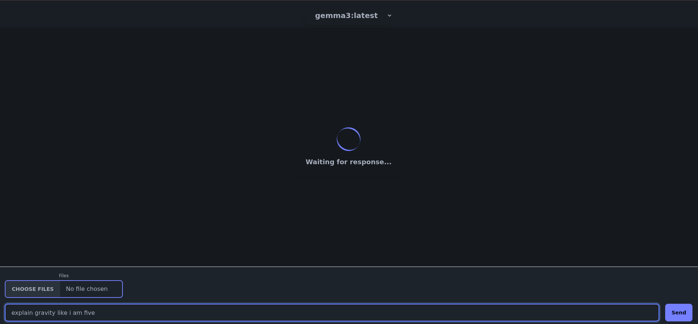

# Schlama Chat Application

Schlama is a modern chat application built with Go (Golang) that provides a sleek and user-friendly interface. It focuses as a CLI tool but offers a light web-interface for GUI lovers.

## Features

> [!NOTE]
> There is still something fishy with the context handling.
> If you encounter any issues, please open an issue on GitHub.

### CLI

The CLI makes it easy to chat with local models, install new ones and add files to them. Also includes a simple subset of the already available Ollama commands such as 'show' and 'rm'.

### Web APP

The web app is just a chat interface for those who like GUIs.
It can select local models and you are able to add files to your prompt.

## Screenshots

<details>
  <summary>Show CLI</summary>

  
  
  
  

</details>

<details>
  <summary>Show Web-App</summary>

  
  

</details>

## Prerequisites

- Go 1.24 or later
- Ollama 

## Installation

1. Clone the repository:

   ```bash
   git clone https://github.com/HanmaDevin/projects.git $HOME
   cd projects/schlama
   ```

2. Build the application:

   ```bash
   make build
   ```

3. Run the application:

   ```bash
   make run
   ```

Or make sure you have the '\$GOPATH' variable set and in '\$PATH' then just:

   ```bash
   make install
   ```

After that you should be able to use it by just typing 'schlama' in the command line.

## Usage

### Command-Line Tools

- **Get Help**:

  ```bash
  schlama -h or schlama --help
  ```

- **List Models**:

  ```bash
  schlama list
  ```

- **Show Local Models**:

  ```bash
  schlama list --local
  ```

- **Select Model**:

  ```bash
  schlama select <model>
  ```

- **Send Prompt**:

  ```bash
  schlama prompt "Your message here"
  ```

- **Send Prompt with File**:

  ```bash
  schlama prompt "Your message here" --file /path/to/file
  ```

- **Send Prompt with Directory content**:

  ```bash
  schlama prompt "Your message here" --directory /path/to/directory
  ```

- **Send Prompt with Images content**:

  Use absolute paths or relative paths from the current working directory. Multiple images can be specified by separating them with commas.
  Environment variables can be used to specify paths, e.g., `$HOME/image.jpg`.

  ```bash
  schlama prompt "Your message here" --images /path/to/image,/path/to/another/image,...
  ``` 

- **Install Model**:

  ```bash
  schlama pull <model>
  ```

- **Uninstall Model**:

  ```bash
  schlama rm <model>
  ```
- **Show Model Info**:

  ```bash
  schlama show <model>
  ```
- **Start interactive Shell**:

  ```bash
  schlama run <model>
  ```

### Web Application

- First start the application with:

  ```bash
  schlama chat
  ```

- Access the application in your browser at `http://localhost:8080`.
- Use the dropdown menu to select a model.
- Enter your message in the text input and click "Send".
- Upload files using the file input above the text box.

## Contributing

Contributions are welcome! Please fork the repository and submit a pull request.

## License

This project is licensed under the MIT License. See the [LICENSE](LICENSE) file for details.
